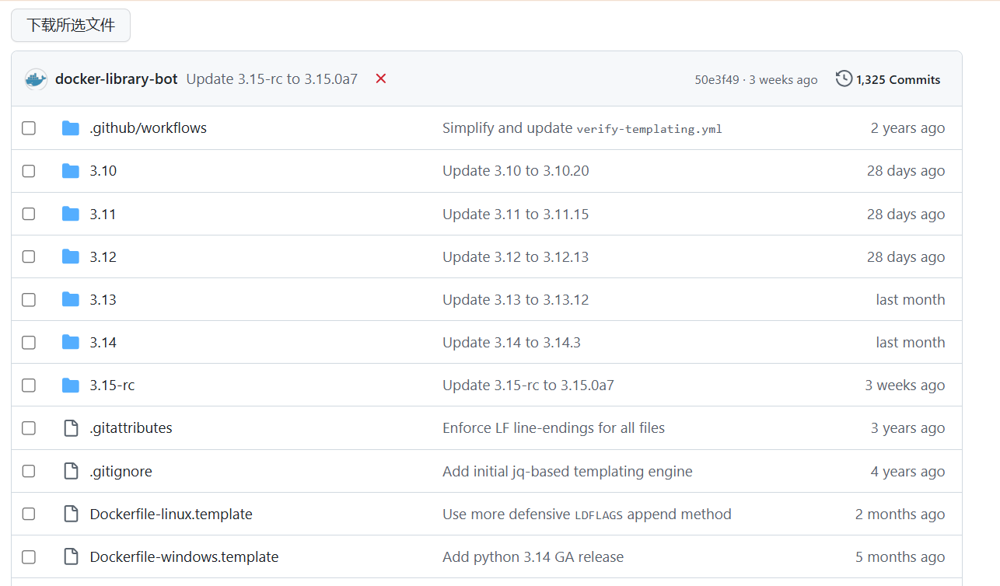

# GitHub 批量下载器

一个用于 GitHub 仓库页面的 Tampermonkey 脚本。它会在 GitHub 文件列表中添加勾选框和“下载所选文件”按钮，方便批量下载文件或文件夹。

## 安装

- GreasyFork: [GitHub 批量下载器](https://greasyfork.org/zh-CN/scripts/575346-github-%E6%89%B9%E9%87%8F%E4%B8%8B%E8%BD%BD%E5%99%A8)
- 脚本管理器：Tampermonkey 或其它兼容用户脚本管理器

## 功能

- 单文件直接下载
- 多文件打包为 ZIP 下载
- 文件夹内容展开后打包下载
- 下载进度提示
- 下载失败自动重试
- 部分文件解析或下载失败时，提示继续下载或重试
- 私有仓库文件夹解析的 GitHub Token 配置

## 基本用法

1. 安装 Tampermonkey 或兼容的用户脚本管理器。
2. 通过 GreasyFork 安装本脚本。
3. 打开 GitHub 仓库文件列表页面。
4. 勾选需要下载的文件或文件夹。
5. 点击“下载所选文件”。

如果只选择一个文件，脚本会保存为原文件名；如果选择多个文件或文件夹，脚本会打包为 ZIP，并在 ZIP 内保留仓库相对路径。

## 私有仓库 Token

下载公开仓库通常不需要配置 Token。

如果需要下载私有仓库中的文件夹，脚本需要通过 GitHub API 读取目录结构。你可以在 Tampermonkey 的脚本菜单中打开“设置 GitHub Token”进行配置。

建议参考 GitHub 官方文档创建 [fine-grained personal access token](https://docs.github.com/en/authentication/keeping-your-account-and-data-secure/managing-your-personal-access-tokens)，并只给目标仓库授予最小权限：

- Repository access：只选择需要使用的仓库
- Permissions：`Contents: Read`

## 已知限制

- 这个脚本不会加速 GitHub 下载，只是批量下载整理工具。
- 文件夹解析依赖 GitHub Git Trees API。
- 过大的文件夹可能因为 GitHub API 返回 `truncated` 而解析失败。
- GitHub API 有速率限制，频繁解析文件夹或下载大型目录时可能失败。
- 私有仓库文件夹解析需要配置有 `Contents: Read` 权限的 GitHub Token。
- 脚本只能下载 GitHub 文件列表中能识别为文件或目录的条目，不包含 Issue、Release、Actions artifact、Git LFS 历史版本或 Git 提交历史。
- GitHub 页面结构变化可能导致脚本临时失效。

如果遇到大目录解析失败，建议减少一次选择的目录范围，或直接使用 `git clone`、GitHub CLI 等方式下载完整仓库。

## 效果

