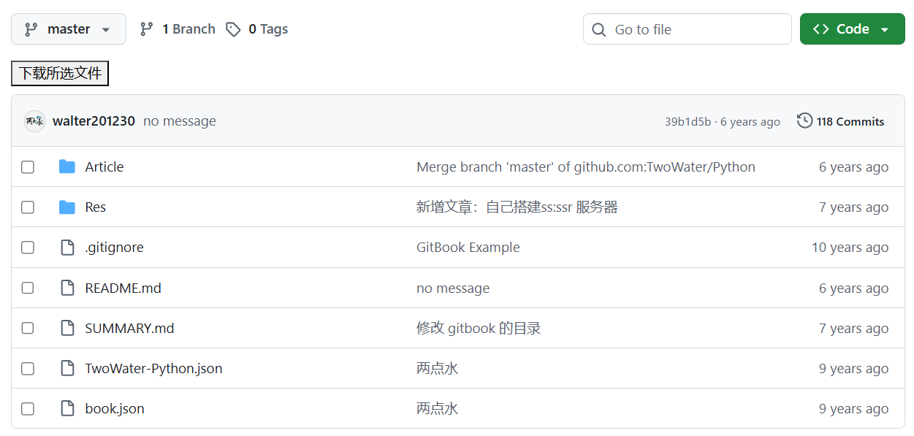

# Github Downloader

一个用于 GitHub 仓库页面的 Tampermonkey 脚本。

目前支持：

- 单文件直接下载
- 多文件打包为 ZIP 下载
- 文件夹内容展开后下载
- 超时/重试
- 私有仓库文件夹解析的 GitHub Token 配置

说明：

- 这个脚本**不会加速** GitHub 下载，只是批量下载整理工具
- 私人仓库文件夹下载需要配置 GitHub Token

基本用法：

1. 在 Tampermonkey 中安装脚本
2. 打开 GitHub 仓库文件页
3. 勾选需要下载的文件并点击“下载所选文件”

效果：

